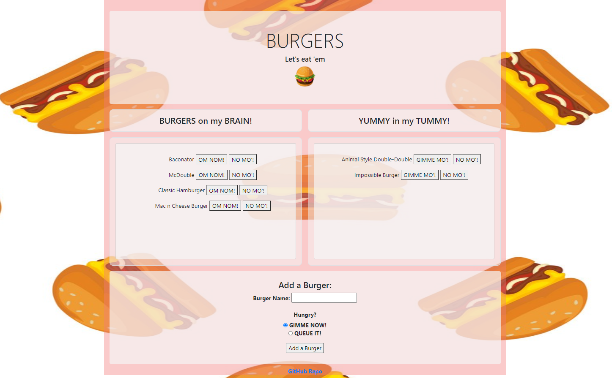

# Burger Logger Application

Burger is an application built to let users input the names of bugers they would like to eat. Whenever the user submits a burger name, the app will display the burger on the left side of the page if they'd like to save it for later, or in this application's case `QUEUE IT!` -- waiting to be devoured.

Each burger in the burger waiting area has an `OM NOM!` button. When the user clicks the button, the burger will move to the right side of the page displaying that it has been virtually devoured by the user.

The application will store every burger name in the database, whether it was devoured or not. 

 

## Coding Process

This application allows the user to:

* Virtually eat a burger

* Save burger to virtually eat later

* Add a burger name

* Delete a burger

 

This application was created with:

* MySQL NPM package to connect to MySQL database and perform queries

* express NPM package to connect to servers

* express-handlebars NPM package to interact handlebars html files

* ORM (object relation mapping module) to map between objects and relational database systems

 

To view this application, please navigate to the **Heroku Deployed Link** below or [click here](https://fathomless-everglades-84577.herokuapp.com/) to view.

 

## Powered By

* [Javascript](https://developer.mozilla.org/en-US/docs/Web/JavaScript)
* [Node.js](https://nodejs.org/en/)
* [npm install](https://nodejs.org/en/)
* [express nodejs](https://www.npmjs.com/package/express)
* [express-handlebars nodejs](https://handlebarsjs.com/)
* [MySQL](https://www.mysql.com/)
* [Heroku](https://www.heroku.com)

 

### Other Resources Used

* [Visual Studio Code](https://code.visualstudio.com/)
    * [How to install VS Code](https://code.visualstudio.com/docs/setup/setup-overview)
* [GitBash](https://gitforwindows.org/)
    * [Download GitBash for Windows](https://git-scm.com/downloads)

 

## Heroku Deployed Link

* [See Deployed Link](https://fathomless-everglades-84577.herokuapp.com/)

 

## Author
**Christy Lee** 

- [Github](https://github.com/christyglee)
- [LinkedIn](https://www.linkedin.com/in/christy-g-lee/)

  

## Acknowledgments

* [Google-Fu](https://www.google.com)
* [w3schools](https://www.w3schools.com/)
* [Stack Overflow](https://stackoverflow.com/search?q=over)
* [Node.js](https://nodejs.org/en/)
* [npm install](https://nodejs.org/en/)
* [MySQL](https://www.mysql.com/)
* [Heroku](https://www.heroku.com)
